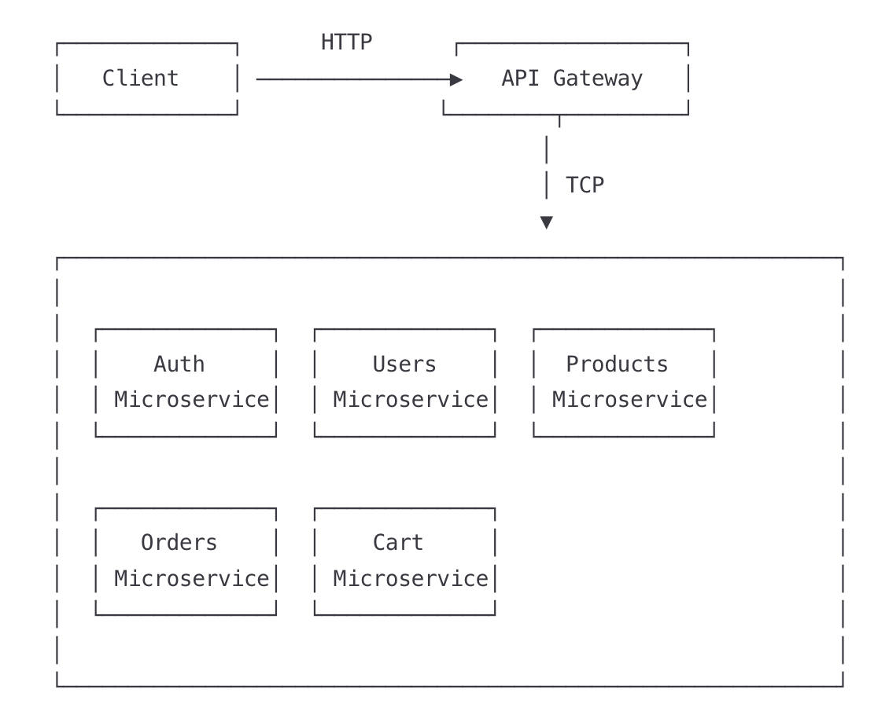

# E-Commerce Application - Microservices Architecture

- This repository hosts a scalable and robust e-commerce platform built using a microservices architecture, leveraging the power of Node.js with NestJS and a suite of modern technologies. Designed for high availability and modularity, this application demonstrates best practices in distributed system design, data management, and inter-service communication.

## ✨ Key Features

- **Modular Architecture:** Each core business domain is encapsulated within its own independent microservice.
- **Scalability:** Services can be scaled independently based on demand.
- **Asynchronous Communication:** Utilizes message brokering for resilient and decoupled interactions.
- **Containerization:** Full Docker support for easy deployment and local development.
- **Data Diversity:** Employs both relational (PostgreSQL) and NoSQL (MongoDB) databases.
- **API Gateway:** A single entry point for all client requests, handling routing and security.

## 📋 Architecture Overview

The application follows a microservices architecture with the following components:

- **API Gateway**: Central entry point handling HTTP requests and routing to appropriate microservices
- **Users Microservice**: Manages user data and operations
- **Auth Microservice**: Handles authentication and authorization
- **Products Microservice**: Manages product catalog and inventory
- **Orders Microservice**: Processes and manages customer orders
- **Cart Microservice**: Handles shopping cart functionality

All services communicate via TCP protocol and are containerized using Docker with orchestration through Docker Compose.

## 🔄 System Communication Flow

- 

## 🛠️ Tech Stack

- **Backend Framework:** Node.js, NestJS (TypeScript)
- **Containerization:** Docker, Docker Compose
- **Databases:**
  - PostgreSQL (Relational)
  - MongoDB (NoSQL)
  - Redis (Caching)
- **Message Broker:** Apache Kafka
- **API Communication:** RESTful APIs
- **Tools:** npm/Yarn, Git

## 📂 Project Structure

```
ecommercemicroservices/
├── 📁 api-gateway/
├── 📁 auth-microservice/
├── 📁 cart-microservice/
├── 📁 libs/
├── 📁 node_modules/
├── 📁 notifications-microservice/
├── 📁 orders-microservice/
├── 📁 products-microservice/
├── 📁 shipping-microservice/
├── 📁 users-microservice/
├── 📄 docker-compose.yaml
├── 📄 endpoints-test.http
├── 📄 endpoints.http
├── 📄 nest-cli.json
├── 📄 package-lock.json
├── 📄 package.json
├── 📄 README.md
├── 📄 tsconfig.build.json
└── 📄 tsconfig.json
```

## 🚀 Getting Started

To run this project locally, ensure you have Docker and Docker Compose installed.

1.  **Clone the repository:**
    ```bash
    git clone [YOUR_REPOSITORY_URL]
    cd ecommerce-app
    ```
2.  **Configure environment variables:**
    ```bash
    cp .env.example .env
    # Edit .env file if necessary to configure database connections, etc.
    ```
3.  **Start all services:**
    ```bash
    docker-compose up --build
    ```
    This command will build all Docker images (if not already built) and start all microservices and their respective databases.

## 🔐 API Endpoints
The **API Gateway** serves as the central point of contact for all client-side requests, providing the following structured routes:

### API Gateway Routes

The API Gateway provides the following routes:

#### Authentication

- `POST /auth/login` - User login
- `POST /auth/register` - User registration

#### Users

- `GET /users` - Get all users (admin)
- `GET /users/:id` - Get user by ID
- `PATCH /users/:id` - Update user
- `DELETE /users/:id` - Delete user

#### Products

- `GET /products` - Get all products
- `GET /products/:id` - Get product by ID
- `POST /products` - Create new product (seller)
- `PATCH /products/:id` - Update product (seller)
- `DELETE /products/:id` - Delete product (seller)

#### Orders

- `GET /orders` - Get user's orders
- `GET /orders/:id` - Get order details
- `POST /orders` - Create new order
- `DELETE /orders/:id` - Cancel order

#### Cart

- `GET /cart` - Get user's cart
- `POST /cart` - Add item to cart
- `PATCH /cart/:itemId` - Update cart item
- `DELETE /cart/:itemId` - Remove item from cart
- `DELETE /cart` - Clear cart

## 🔄 Microservice Communication

The microservices communicate with each other using NestJS's built-in TCP transport layer:

- API Gateway initiates requests to microservices
- Auth service validates tokens and provides user authentication
- Services maintain their own databases but can request data from other services as needed

## 📦 Database Models

### Users Service (PostgreSQL)

- User entity with authentication and profile data

### Products Service (PostgreSQL)

- Product entity with details and images
- Category management

### Orders Service (PostgreSQL)

- Order entity linked to users
- OrderItem entities linked to products

### Cart Service (MongoDB)

- Cart documents with user ID
- CartItem subdocuments with product information

## 🔍 Testing

Run tests for each microservice:

```bash
# Example for testing the Users microservice
cd users-microservice
npm run test
```

## 🛡️ Security

- JWT authentication for API access
- Role-based access control
- Secure communication between services
- Environment-based configuration

## 📝 Development Notes

- Each microservice has its own independent NestJS application
- Services are not using NestJS Monorepo structure but are maintained in a single Git repository
- Each service has its own `package.json`, `tsconfig.json`, `.env`, and `Dockerfile`
- Communication between services is handled through TCP protocol
- API Gateway handles HTTP requests and proxies them to appropriate microservices

## 🤝 Contributing

1. Fork the repository
2. Create a new branch (`git checkout -b feature/amazing-feature`)
3. Commit your changes (`git commit -m 'Add some amazing feature'`)
4. Push to the branch (`git push origin feature/amazing-feature`)
5. Open a Pull Request

## 📜 License

This project is licensed under the MIT License - see the LICENSE file for details.

- Note: npx @nestjs/cli new orders-microservice --skip-git


### Some Notes:
for cache cleaning and reload the all package:
```typescript
npm cache clean --force
rm -rf node_modules package-lock.json
npm install --legacy-peer-deps
```

Use only one terminal script
```
rm -rf node_modules package-lock.json && npm cache clean --force && npm install
```