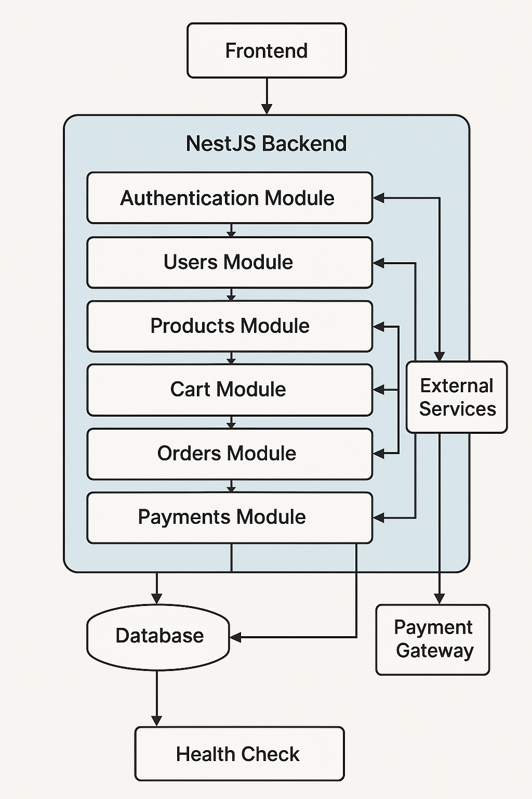
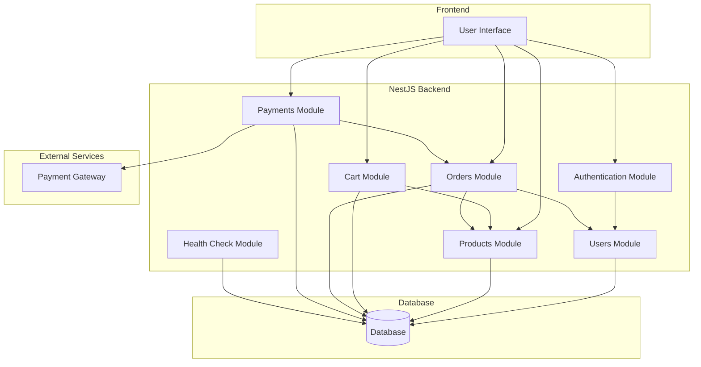
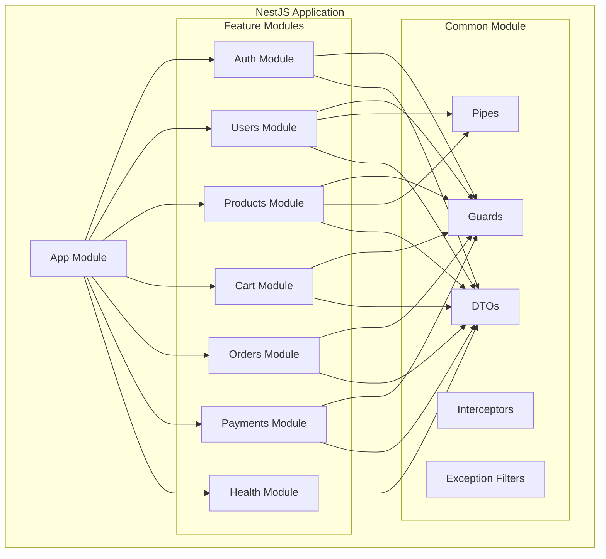
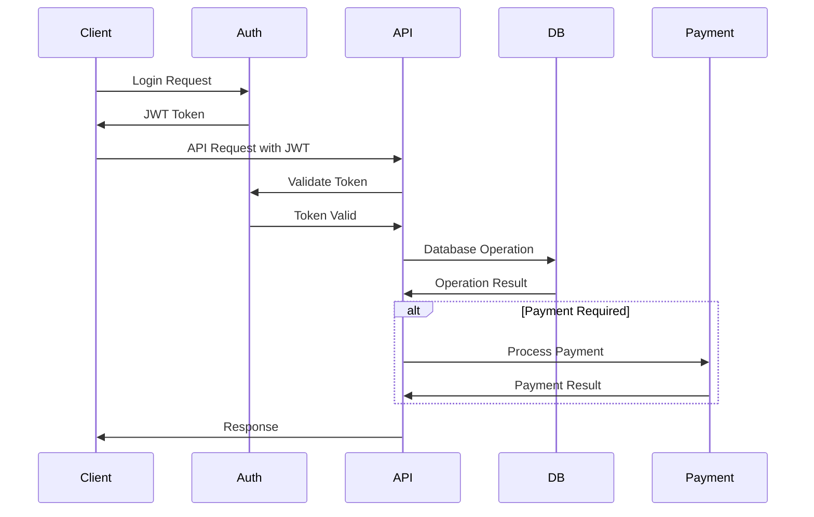
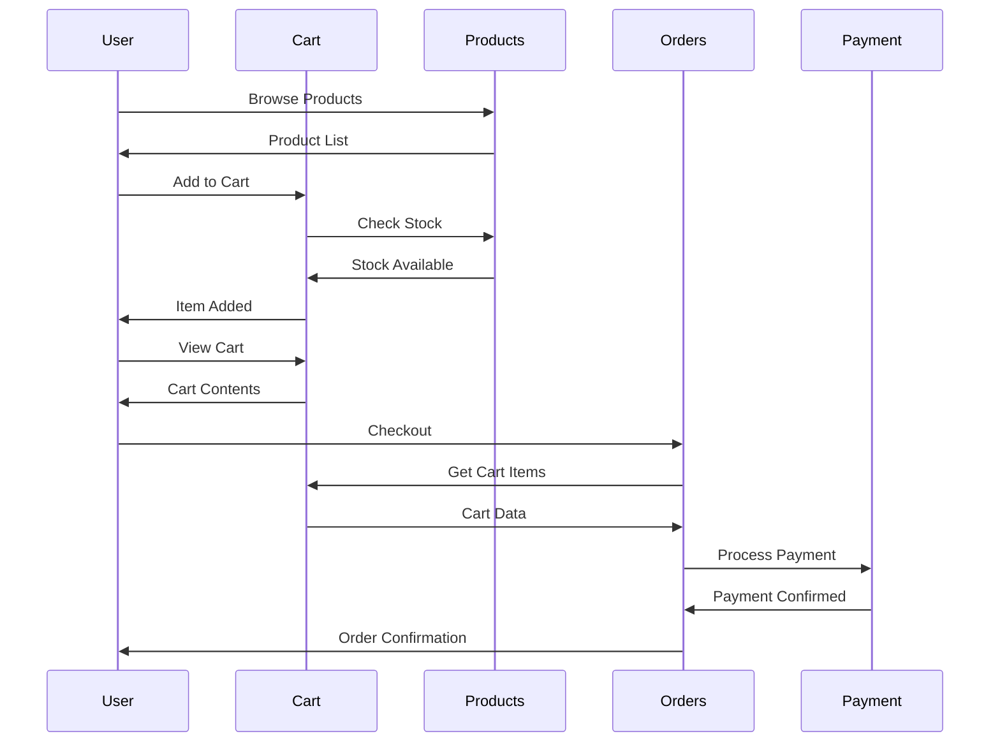
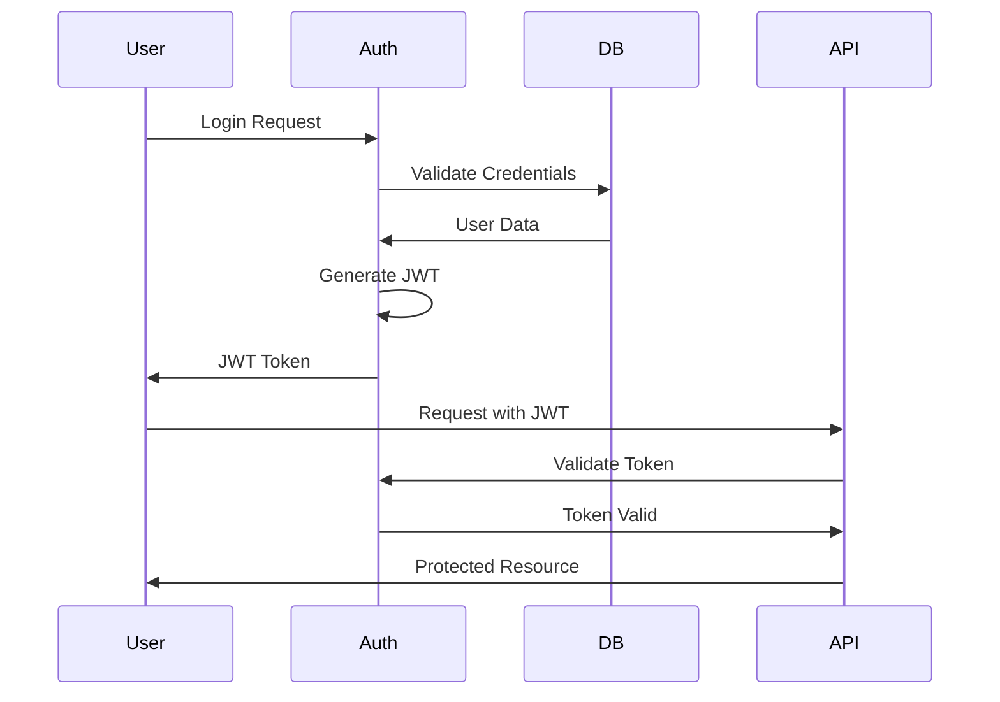
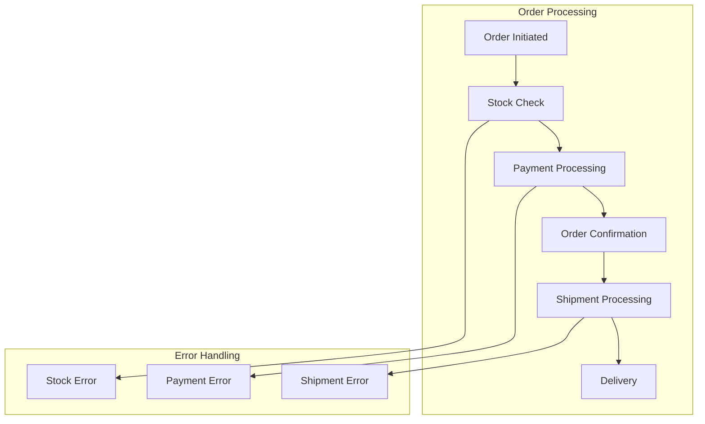

```mermaid
graph TB
    subgraph API Endpoints
        Auth[Auth Endpoints]
        Users[User Endpoints]
        Products[Product Endpoints]
        Cart[Cart Endpoints]
        Orders[Order Endpoints]
        Payments[Payment Endpoints]
    end
    subgraph Auth Endpoints
        Login[POST /auth/login]
        Register[POST /auth/register]
        Refresh[POST /auth/refresh]
    end
    subgraph User Endpoints
        GetUser[GET /users/:id]
        UpdateUser[PUT /users/:id]
        DeleteUser[DELETE /users/:id]
    end
    subgraph Product Endpoints
        ListProducts[GET /products]
        GetProduct[GET /products/:id]
        CreateProduct[POST /products]
        UpdateProduct[PUT /products/:id]
        DeleteProduct[DELETE /products/:id]
    end
    Auth --> Login
    Auth --> Register
    Auth --> Refresh
    Users --> GetUser
    Users --> UpdateUser
    Users --> DeleteUser
    Products --> ListProducts
    Products --> GetProduct
    Products --> CreateProduct
    Products --> UpdateProduct
    Products --> DeleteProduct
```

# 🏗️ E-Commerce System Architecture Diagrams

This document provides visual representations of the e-commerce system architecture, module structure, data flow, and more. These diagrams serve as a guide to understanding the overall system design and functionalities.

## 📊 System Architecture Overview

----

### Description:
This diagram illustrates the high-level architecture of the e-commerce system. The frontend interacts with various backend modules, which communicate with a central database and external services like payment gateways.

---

## 📁 Module Structure

### Description:
This diagram outlines the internal structure of the NestJS application, showcasing how feature modules and common components are organized. Each module encapsulates related functionalities, while the common module provides shared components.

---

## 🔄 Data Flow

### Description:
This sequence diagram illustrates the flow of data during a typical user authentication and API request process. It highlights how the client interacts with the authentication module and API, including token validation and database operations.

---

## 🛒 Shopping Cart Flow

### Description:
This diagram outlines the process of adding items to the shopping cart and proceeding to checkout. It shows the interaction between the user, products, cart, orders, and payment processes.

---

## 🔐 Authentication Flow

### Description:
This diagram represents the user authentication process, detailing how the user logs in, how credentials are validated, and how JWT tokens are used for accessing protected resources.

---

## 📦 Order Processing Flow

### Description:
This diagram illustrates the steps involved in processing an order, from initiation through to delivery, including error handling for potential issues at each stage.

---

## 🔍 API Endpoints Structure

### Description:
This diagram provides an overview of the API endpoints available in the application, categorized by functionality. Each endpoint is clearly defined, indicating the HTTP methods and paths.

---

### Final Notes
- Ensure that the diagrams are updated to reflect any changes in your system architecture or workflows.
- Consider adding additional sections for future enhancements, deployment strategies, or specific technologies used in your stack.
